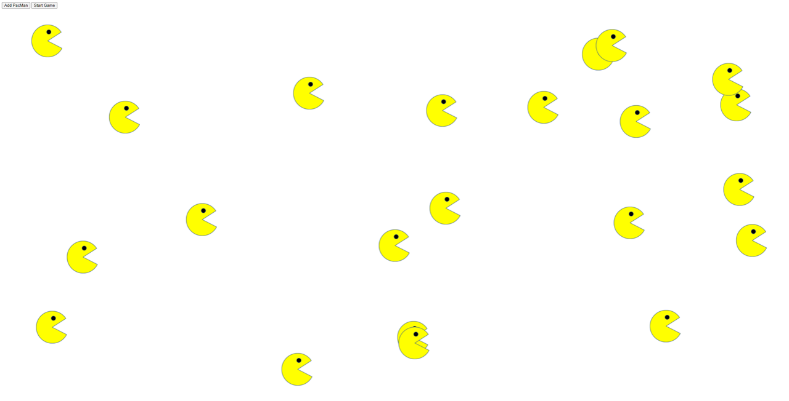

# PacMen Exercise
## Description
MIT xPro® Professional Certificate in Coding Boot Camp Project: PacMen Exercise. This project involved DOM manipulation in which we inserted multiple pac men upon a mouse click which then subsequently bounced off screen walls. 

## Installation
Clone the index.html, pacmen.js, and all the image files into your GitHub repo. Fork into your repository. Open your source code editor of choice and copy the code and save it to your local machine. Then create an about:blank page in your browser of choice and move the index.html file into the search bar.

## Usage
Click on the Add PacMen and then click on Start and watch the PacMen bounce around.

## Support
The Pac Man game and support is now available for mobile devices. Go to Google Play Store or the Apple App Store to download.

## Roadmap
This project is presented as a part of student boot camp portfolio. I will modify when my skill sets improves.

